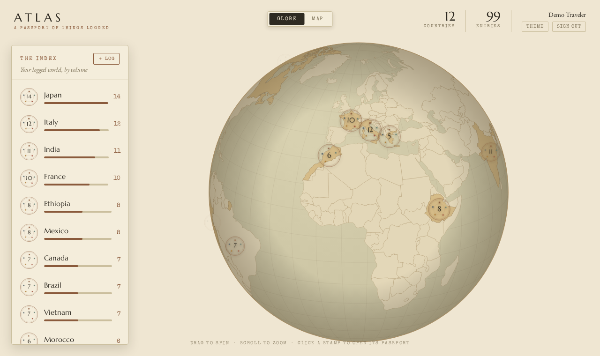

# Atlas — A Passport of Things Logged

Log the recipes, books, films, music, and places you've experienced from around
the world. Each country becomes a postmark stamp on a spinning vintage globe;
open any country to flip through its "passport" of logged entries.

Built from the Claude design export *Global logging passport app* as a real,
account-backed full‑stack app.



## Stack

- **Next.js 14 (App Router) + TypeScript** — UI and JSON API in one codebase
- **Prisma + SQLite** for local dev (one-line switch to Postgres for production)
- **Email / password auth** — bcrypt hashing, signed JWT in an httpOnly cookie
  (no external OAuth provider needed to run)
- **d3-geo + topojson + world-atlas** — the orthographic globe / natural-earth
  map, rendered to a canvas; postmark stamps are generated SVG

## Quick start

```bash
npm install
cp .env.example .env          # then edit AUTH_SECRET (any long random string)
npx prisma db push            # create the SQLite schema
npm run db:seed               # seed the demo account
npm run dev                   # http://localhost:3000
```

### Demo account

A populated account is seeded for you:

- **Email:** `demo@atlas.app`
- **Password:** `password`

(The login screen also has a one‑click "Use the demo account" link.) Or create
your own account — it starts with an empty atlas and the **＋ Log** button.

## How it works

- `GET /` (server component) reads the session cookie, loads that user's entries
  straight from the DB, and hands them to the client `AtlasApp`.
- The globe spins, highlights logged countries, and drops a stamp on each.
  Clicking a country (or an item in the **Index** rail) opens its passport.
- **Log an entry** (per‑country, or the global **＋ Log** modal) POSTs to the
  API and updates the globe live. Entries persist per account.
- **Logbook** (`/logbook`) is the second view: a passport page where every entry
  is a worn rubber‑stamp impression (round / oval / rect / hex / cog in category
  ink), clustered and paged country by country — from a quiet visit to a
  well‑worn passport.
- Themes: a **Theme** button cycles three palettes (Sepia Atlas, Kraft &
  Oxblood, Midnight Customs).

### API

| Method & path            | Purpose                                  |
| ------------------------ | ---------------------------------------- |
| `POST /api/auth/register`| Create account, start a session          |
| `POST /api/auth/login`   | Sign in                                  |
| `POST /api/auth/logout`  | Clear the session                        |
| `GET  /api/auth/me`      | Current user (or 401)                    |
| `GET  /api/entries`      | List the signed‑in user's entries        |
| `POST /api/entries`      | Log a new entry                          |
| `DELETE /api/entries/:id`| Remove one of your entries               |

## Project layout

```
prisma/
  schema.prisma     User / Entry models
  seed.ts           demo account + the design export's dataset
src/
  app/
    page.tsx        authed home → AtlasApp
    logbook/        the stamped logbook page
    login/          auth screen
    api/            auth + entries route handlers
  components/
    AtlasApp.tsx    world chrome, state, API wiring
    Globe.tsx       d3-geo canvas globe engine (ported from the export)
    Passport.tsx    per-country detail page
    Logbook.tsx     worn-ink stamp cluster, paged by country
    LogModal.tsx    global "log an entry" modal
    AuthForm.tsx    sign in / create account
  lib/
    auth.ts         password hashing + JWT session
    db.ts           Prisma client
    countries.ts    loggable country catalog (keyed by world-atlas id)
    categories.ts   recipe / book / movie / music / place
    palettes.ts     the three themes
    stamps.ts       postmark / postage SVG builders
    inkstamps.ts    worn rubber-stamp SVG builders (logbook)
    logbook.ts      group entries → per-country records
```

## Going to production (Postgres)

1. In `prisma/schema.prisma`, set `provider = "postgresql"`.
2. Set `DATABASE_URL` to your Postgres connection string.
3. Set a strong `AUTH_SECRET` (e.g. `openssl rand -base64 48`).
4. `npx prisma migrate dev` (or `prisma migrate deploy` in CI), then
   `npm run build && npm start`.

## Useful scripts

| Script              | Does                                            |
| ------------------- | ----------------------------------------------- |
| `npm run dev`       | Dev server                                      |
| `npm run build`     | `prisma generate` + production build            |
| `npm run db:seed`   | Seed / refresh the demo account                 |
| `npm run db:reset`  | Drop, recreate, and reseed the database         |
